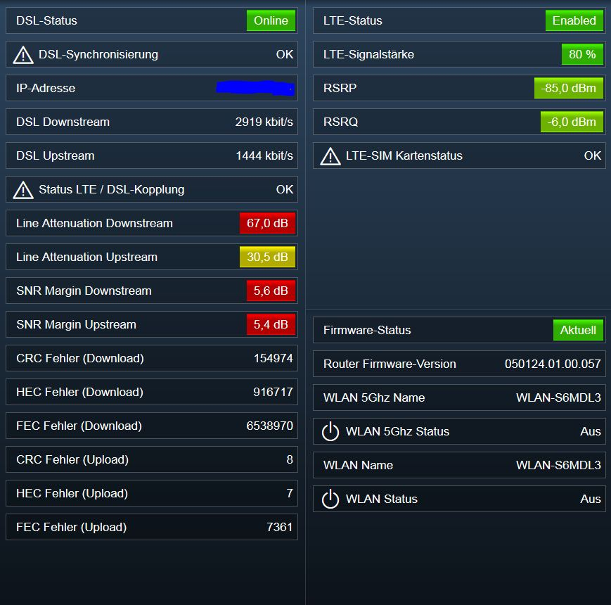
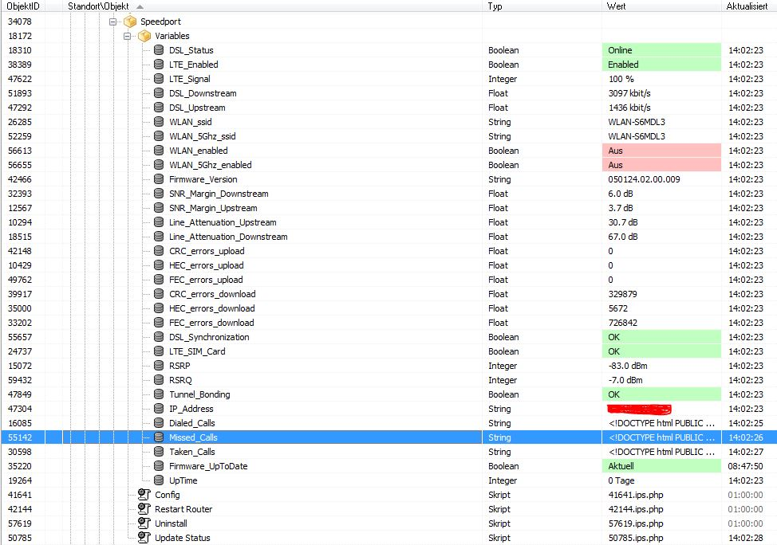
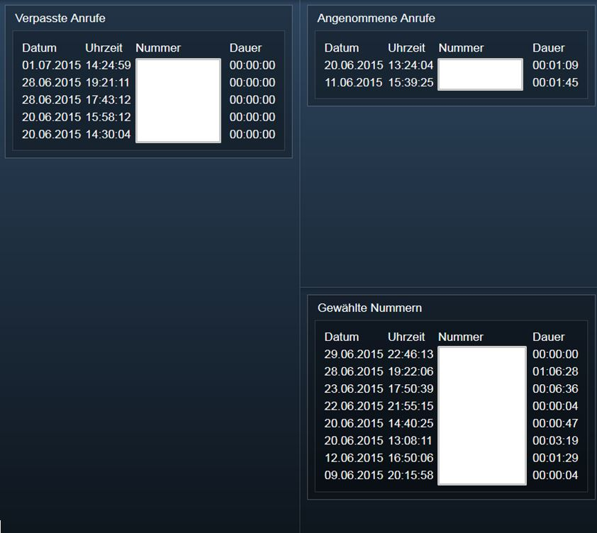

# ips-speedport
Telekom Speedport Hybrid Anbindung für IP-Symcon

## Aufgabe des Skripts
Dieses Skript greift auf die Weboberfläche des Telekom Speedport Hybrid Routers zu und liest dabei alle möglichen Informationen aus. Dazu gehören u.a. DSL-Status, IP-Adresse, Anruflisten, DSL-Informationen, Leitungsqualität, LTE-Verbindungsqualität, WLAN-Informationen, etc. 

### Unterstützte Firmware
Getestet wurde das Skript mit dem jeweils zum Testdatum aktuellen Entwicklungsstand. Spätere Weiterentwicklungen sind nicht mit den älteren Firmware-Versionen getestet.

* 29.07.2015 => Firmware 050124.01.00.057
* 29.07.2015 => Firmware 050124.02.00.009

## Weiterführende Informationen
Das Skript legt selbstständig benötigte IPS-Variablen und Variablenprofile unterhalb des Skriptes an.
Derzeit sind dies 30-Variablen und 10 Variablenprofile. (Je nach IP-Symcon Lizenz bitte berücksichtigen)
Durch das Speichern der Werte in IPS-Variablen wird Logging und das Anbinden von IPS-Events ermöglicht.
Zur besseren Auffindbarkeit und eindeutigen Zuordnung werden alle Variablenprofile mit einem Präfix angelegt. 
Standardmässig lautet das `Speedport_`.

Die in den Variablenprofilen festgelegten Wertungen (was ist gut und was schlecht) von Dämpfungswerten, etc. basieren auf Daten aus meiner Internetrecherche. Dafür keine Gewähr :-)

Es ist zu berücksichtigen, dass jeder Aufruf dieses Skripts andere Benutzer aus der Weboberfläche des Routers herauswirft.
Desweiteren benötigt das Skript je nach Rechenkapazität und Verbindung des IPS-Hosts zum Router einen Moment zur Ausführung.
Bei mir sind es bis zu 10 Sekunden. 

Ältere Speedportmodelle verfügen über ein anderes Webinterface / Anmeldeverfahren und funktionieren voraussichtlich nicht. Eventuell funktioniert es mit aktuellen Non-Hybrid-Speedports. 

## Installation

1. Dieses Repository im IP-Symcon Unterordner `webfront/user/` klonen. Bsp.: `C:\IP-Symcon\webfront\user\ips-speedport` oder alternativ als zip-Datei herunterladen und in den `IP-Symcon/webfront/user` Unterordner entpacken.
2. In der IP-Symcon Verwaltungskonsole eine Kategorie `Speedport` und eine Unterkategorie `Variables` erstellen (Namen und Ablageorte sind frei wählbar)
3. Unterhalb der Kategorie `Speedport` sind mehrere Skripte manuell anzulegen. Diese sind u.a. die Konfiguration (IP des Routers, sowie das Passwort für den Zugang auf dessen Weboberfläche, als auch diverse Skripte zum Ausführen von Aktionen auf dem Router (Status update, Neustart, etc.). Die anzulegenden Skripte befinden sich im Unterordner `ips-scripts` und können per copy&paste in die IPS-Console eingetragen werden. Alternativ sind die Skripte auch weiter unten direkt beschrieben.

zur schnelleren Deinstallation gibt's ganz unten eine auskommentierte Funktion `$sp->cleanup();`.
Wenn diese Funktion ausgeführt wird, werden alle erstellten Variablen und Variablenprofile wieder gelöscht.
(Achtung: Variablenprofile werden anhand des Präfix gesucht. Wenn der geändert wurde und noch alte Profile existieren, werden diese nicht automatisch gelöscht.) 

###config script
Enthält die "globale" Konfiguration der Speedport-Anbindung und wird von den anderen IPS-Speedport-Scripten aufgerufen.
```php
<?
$password = "deinPasswort"; //Kennwort für den Zugriff auf den Router
$url = "http://192.168.1.1/"; //IP-Adresse des Speedport-Routers (häufig auch "speedport.ip")
$parentId = 18172 /*[System\Skripte\Speedport\Variables]*/; //Speicherort für zu erstellende Speedport Variablen.

/** OPTIONALE ANPASSUNGEN **/
$debug = false;	//Debug-Informationen auf Konsole ausgeben
$variable_profile_prefix = "Speedport_"; //Prefix für anzulegende Variablenprofile
$call_sort = SORT_DESC; //Sortier-Reihenfolge für Anruflisten. SORT_DESC => neueste zuerst, SORT_ASC => älteste zuerst.

//Intervall in Minuten in dem eine Firmware-Updateprüfung erfolgen soll
//(aufwändige Funktion; nicht so oft durchführen. Bsp.: 1 mal im Monat => ca. 43200 Minuten)
$fw_update_interval = 43200;
?>
```

###update status script
Sammelt alle Statusinformationen, Anruferlisten, etc. und legt diese in den dafür vorgesehenen IPS Variablen ab.
Es ist ratsam dieses Skript per Interval-Ereignis in IP-Symcon regelmäßig auszuführen. (bsp.: alle 10 Minuten)
```php
<?
$config_script = 41641 /*[System\Skripte\Speedport\Config]*/; //instanz id des ip-symcon config skripts

require_once(IPS_GetScript($config_script)['ScriptFile']);
require_once('../webfront/user/ips-speedport/IPSSpeedportHybrid.class.php');
 
$sp = new IPSSpeedportHybrid($password, $url, $debug, $variable_profile_prefix, $call_sort, $parentId, $fw_update_interval);
$sp->update();
?>
```

##Externe Quellen

Das Script setzt die Klasse "speedport" von Jan Altensen voraus. Diese ist in diesem Skript inkludiert. [Quelle Speedport-Klasse von Jan Altensen] (https://github.com/Stricted/speedport-hybrid-php-api/).

###Screenshots



